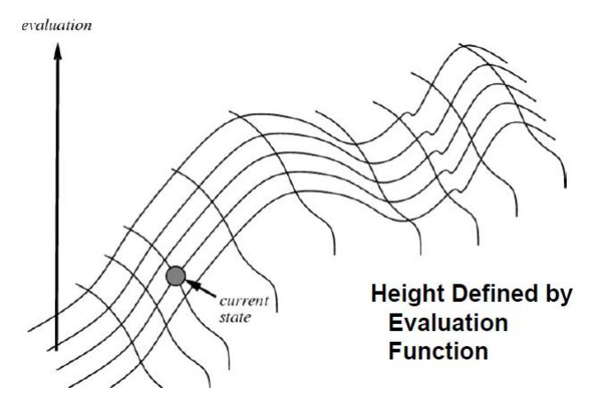
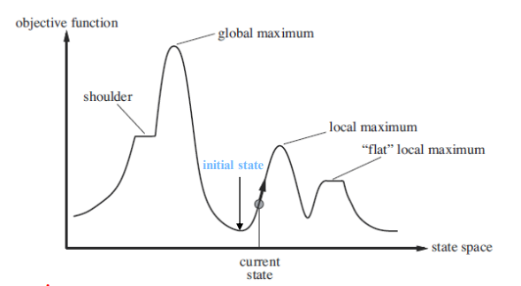

# Assignment2: Hill climbing
Solve the N-Queens problem with Hill Climbing approach.

## Environments
Tested environments
- Java SE 8u221
- OpenJDK 8
- Windows 10
- Ubuntu 18.04 (WSL)

Suggested environments
- Java >= 8
- bash or PowerShell environment

## Usage
To compile and run
```
mkdir classes
javac -d classes assignment2/Application.java
cd classes
java assignment2.Application 7 /abs/path/to/save/result
```

## Sample result
board size 7
```
>Hill Climbing
Location : 1 3 0 6 4 2 5
Time : 0.097
```
board size 8
```
>Hill Climbing
Location : 3 6 4 1 5 0 2 7
Time : 0.375
```
board size 12
```
>Hill Climbing
Location : 6 10 2 0 3 8 4 1 9 11 5 7
Time : 22.732
```

## Methods

### 1. Hill climbing

Local Search의 일종으로 현재의 상태와 Neighbor의 상태만을 통해 목적 함수 Objective의 최대 혹은 최솟값 탐색을 목적으로 한다.

Hill climbing은 문제 환경에서 State와 Neighbor를 정의하고, 현재의 State에서 Objective를 최대 혹은 최소화하는 Neighbor를 선택 이동, Greedy search와 같이 재귀적으로 Objective의 극값을 찾아간다.

```py
def hill_climbing(problem):
    current = make_node(problem.inital_state())
    while True:
        neighbor = highest(current.successor())
        if neighbor.value <= current.value:
            return current.state
        current = neighbor
    return current
```



이때 Hill climbing은 global context가 아닌 local context만을 보기 때문에, 접근 중인 optima가 local optima인지 global optima인지 알 수 없다. 이러한 문제를 해결하기 위해 Random restart 혹은 Random walk 등의 부가적인 policy가 필요하다.



N-Queens의 문제 환경에서 State와 Neighbor는 다음과 같이 정의할 수 있다.
- State: Queen의 위치를 나타내는 NxN boolean matrix
- Neighbor: N개의 Queen 중 하나를 골라 1칸 이동 (Nx8 Neighbor State)

이때 objective의 global optima가 N-Queens problem의 solution이라 가정하면, random initial state에 대해서 neighbor를 objective에 따라 평가하고, neighbor selection policy에 따라 다음 상태를 선택해 가면 문제를 해결할 수 있다.

### 2. Objective

N-Queens의 Constraint는 다음과 같다.
- 각 행에는 하나의 Queen만이 존재한다.
- 각 열에는 하나의 Queen만이 존재한다.
- 각 대각선에는 하나 이하의 Queen이 존재한다.

이를 Objective로 활용하기 위해 각 행과 열, 대각선에 몇 개의 Queen이 존재하는지 나타내는 배열을 정의한다. 이후, 각 배열이 가지는 constraint를 기반으로 objective를 설계한다.
```py
objective = sum(abs(r - 1) for r in row) +
            sum(abs(c - 1) for c in col) +
            sum(max(x - 1, 0) for x in rightdown) +
            sum(max(y - 1, 0) for y in leftdown)
where row, col = N size array
      rightdown, leftdown = (2N - 1) size array
```
여기서 row와 col은 각 행과 열에 위치하는 Queen의 개수, rightdown은 우하향 대각선, leftdown은 좌하향 대각선을 의미한다.

주어진 NxN boolean matrix가 constraint를 만족한다면 objective는 0에 수렴할 것이고, 더 많은 constraint를 어길수록 큰 값을 가지게 된다. N-Queens를 해결하기 위해 해당 objective를 최소로 하는 Hill climbing method를 실행한다.

### 3. Escaping local optima and Neighbor selection

N-Queens problem에선 앞서 정의된 Objective가 0에 수렴해야 solution이 존재한다. 이때 0보다 큰 값에서 objective가 수렴할 경우 N-Queens solution을 찾을 수 없다. 이렇게 local optima에 빠질 경우 이를 빠져나갈 policy가 필요하다.

- Random walk, Stochastic selection

neighbor를 평가하여 선택하는 과정에서, 무조건 가장 높은 값을 선택하기보단 확률적인 프로세스를 통해 적절한 neighbor를 선택한다.

- Random restart

local optima에 빠진 경우, random state에서 다시 시작한다.

[Hill Climbing](./hillclimbing/HillClimbing.java) 구현체에서는 후자를 선택하여 neighbor 선발 방식에서 전자보다 높은 자율성을 부여하였다. Random restart와 모든 neighbor 중 가장 높은 평가치를 가진 상태를 선택하는 방식을 채택하였다.

### 4. Experiment

1. 수렴 시간


2. Random restart 횟수


3. 전체 문제 해결 시간

Board size 4 ~ 10, 보드 크기당 100회 실험, 전체 문제 해결 시간의 평균 및 성공 확률

| board size | 4 | 5 | 6 | 7 | 8 | 9 | 10 |
|---|---|---|---|---|---|---|---|
| elapsed time | 0.008197 | 0.001953 | 0.033636 | 0.04597 | 0.28027 | 0.99786 | 8.6658 |
| success rate | 0.76 | 0.64 | 0.99 | 0.99 | 1 | 1 | 1 |

### 5. Log

전체 문제 해결 시간 데이터
| size | 0 | 1 | 2 | 3 | 4 | 5 | 6 | 7 | 8 | 9 | 10 | 11 | 12 | 13 | 14 | 15 | 16 | 17 | 18 | 19 | 20 | 21 | 22 | 23 | 24 | 25 | 26 | 27 | 28 | 29 | 30 | 31 | 32 | 33 | 34 | 35 | 36 | 37 | 38 | 39 | 40 | 41 | 42 | 43 | 44 | 45 | 46 | 47 | 48 | 49 | 50 | 51 | 52 | 53 | 54 | 55 | 56 | 57 | 58 | 59 | 60 | 61 | 62 | 63 | 64 | 65 | 66 | 67 | 68 | 69 | 70 | 71 | 72 | 73 | 74 | 75 | 76 | 77 | 78 | 79 | 80 | 81 | 82 | 83 | 84 | 85 | 86 | 87 | 88 | 89 | 90 | 91 | 92 | 93 | 94 | 95 | 96 | 97 | 98 | 99 |
|---|---|---|---|---|---|---|---|---|---|---|---|---|---|---|---|---|---|---|---|---|---|---|---|---|---|---|---|---|---|---|---|---|---|---|---|---|---|---|---|---|---|---|---|---|---|---|---|---|---|---|---|---|---|---|---|---|---|---|---|---|---|---|---|---|---|---|---|---|---|---|---|---|---|---|---|---|---|---|---|---|---|---|---|---|---|---|---|---|---|---|---|---|---|---|---|---|---|---|---|---|
| 4 | 0.041 | 0.001 | 0.001 | 0.008 | 0.005 | 0.002 | 0.002 | 0.001 | 0.043 | 0.002 | 0.004 | 0.003 | 0.006 | 0.003 | 0.001 | 0.002 | 0.001 | 0.042 | 0.001 | 0.012 | 0.002 | 0.001 | 0.003 | 0.003 | 0.002 | 0.042 | 0.009 | 0.007 | 0.002 | 0.002 | 0.001 | 0.042 | 0.002 | 0.002 | 0.001 | 0.001 | 0.002 | 0.001 | 0.004 | 0.001 | 0.045 | 0.001 | 0.008 | 0.004 | 0.002 | 0.002 | 0.001 | 0.001 | 0.044 | 0.002 | 0.008 | 0.005 | 0.001 | 0.001 | 0.001 | 0.044 | 0.007 | 0.003 | 0.001 | 0.001 | 0.001 | 0.001 | 0.001 | 0.042 | 0.014 | 0.001 | 0.001 | 0.002 | 0.002 | 0.001 | 0.042 | 0.012 | 0.007 | 0.001 | 0.001 | 0.001 |
| 5 | 0.002 | 0.003 | 0.002 | 0.005 | 0.003 | 0.001 | 0.002 | 0.001 | 0.002 | 0.003 | 0.001 | 0.001 | 0.008 | 0.001 | 0.001 | 0.005 | 0.001 | 0.001 | 0.002 | 0.001 | 0.001 | 0.001 | 0.001 | 0.001 | 0.001 | 0.003 | 0.004 | 0.003 | 0.003 | 0.001 | 0.001 | 0.002 | 0.002 | 0.002 | 0.001 | 0.001 | 0.002 | 0.001 | 0.001 | 0.006 | 0.001 | 0.001 | 0.002 | 0.003 | 0.001 | 0.001 | 0.001 | 0.001 | 0.001 | 0.001 | 0.001 | 0.001 | 0.001 | 0.001 | 0.003 | 0.001 | 0.004 | 0.001 | 0.006 | 0.001 | 0.001 | 0.004 | 0.001 | 0.002 |
| 6 | 0.045 | 0.012 | 0.006 | 0.038 | 0.024 | 0.003 | 0.01 | 0.007 | 0.021 | 0.062 | 0.039 | 0.002 | 0.016 | 0.049 | 0.073 | 0.017 | 0.013 | 0.03 | 0.044 | 0.012 | 0.022 | 0.021 | 0.003 | 0.045 | 0.003 | 0.051 | 0.01 | 0.039 | 0.042 | 0.052 | 0.015 | 0.034 | 0.007 | 0.018 | 0.002 | 0.087 | 0.025 | 0.064 | 0.004 | 0.011 | 0.007 | 0.009 | 0.03 | 0.088 | 0.011 | 0.009 | 0.045 | 0.109 | 0.032 | 0.04 | 0.075 | 0.022 | 0.049 | 0.081 | 0.004 | 0.033 | 0.022 | 0.1 | 0.001 | 0.02 | 0.074 | 0.005 | 0.003 | 0.015 | 0.065 | 0.001 | 0.023 | 0.01 | 0.039 | 0.045 | 0.221 | 0.013 | 0.025 | 0.019 | 0.004 | 0.027 | 0.022 | 0.098 | 0.001 | 0.045 | 0.034 | 0.026 | 0.037 | 0.097 | 0.036 | 0.01 | 0.031 | 0.046 | 0.094 | 0.001 | 0.03 | 0.005 | 0.025 | 0.033 | 0.012 | 0.173 | 0.001 | 0.002 | 0.017 |
| 7 | 0.071 | 0.052 | 0.032 | 0.038 | 0.014 | 0.075 | 0.008 | 0.008 | 0.131 | 0.073 | 0.002 | 0.198 | 0.065 | 0.001 | 0.041 | 0.035 | 0.082 | 0.021 | 0.002 | 0.017 | 0.007 | 0.02 | 0.038 | 0.007 | 0.105 | 0.061 | 0.027 | 0.048 | 0.018 | 0.066 | 0.025 | 0.092 | 0.029 | 0.053 | 0.045 | 0.041 | 0.024 | 0.031 | 0.004 | 0.177 | 0.006 | 0.012 | 0.049 | 0.052 | 0.006 | 0.165 | 0.012 | 0.015 | 0.115 | 0.028 | 0.03 | 0.035 | 0.006 | 0.058 | 0.039 | 0.017 | 0.064 | 0.016 | 0.054 | 0.013 | 0.03 | 0.008 | 0.13 | 0.013 | 0.037 | 0.053 | 0.038 | 0.009 | 0.046 | 0.011 | 0.025 | 0.019 | 0.018 | 0.036 | 0.113 | 0.006 | 0.023 | 0.059 | 0.027 | 0.097 | 0.107 | 0.017 | 0.045 | 0.02 | 0.006 | 0.009 | 0.063 | 0.002 | 0.093 | 0.085 | 0.048 | 0.019 | 0.006 | 0.054 | 0.149 | 0.021 | 0.16 | 0.116 | 0.057 |
| 8 | 0.56 | 0.088 | 0.861 | 0.94 | 0.036 | 0.444 | 0.137 | 0.575 | 0.115 | 0.093 | 0.029 | 0.205 | 0.435 | 0.503 | 0.263 | 0.711 | 0.374 | 0.352 | 0.151 | 0.463 | 0.017 | 0.3 | 0.165 | 0.204 | 0.035 | 0.432 | 0.292 | 0.015 | 0.461 | 0.099 | 0.438 | 0.1 | 0.258 | 0.069 | 0.442 | 0.457 | 0.115 | 0.101 | 0.003 | 0.009 | 0.425 | 0.08 | 0.128 | 0.871 | 0.351 | 0.008 | 0.029 | 0.303 | 0.244 | 0.323 | 0.11 | 0.183 | 1.226 | 0.196 | 0.575 | 0.427 | 0.782 | 0.091 | 0.536 | 0.036 | 0.017 | 1.284 | 0.018 | 0.1 | 0.232 | 0.073 | 0.081 | 0.513 | 0.139 | 0.4 | 0.607 | 0.068 | 0.005 | 0.214 | 0.001 | 0.019 | 0.181 | 0.243 | 0.004 | 0.318 | 0.16 | 0.7 | 0.008 | 0.056 | 0.341 | 0.017 | 0.441 | 0.524 | 0.02 | 0.017 | 0.168 | 0.002 | 0.33 | 0.195 | 0.137 | 1.282 | 0.028 | 0.594 | 0.197 | 0.022 |
| 9 | 1.051 | 0.415 | 0.04 | 2.001 | 0.517 | 0.788 | 0.023 | 3.621 | 0.072 | 0.735 | 1.059 | 0.393 | 0.984 | 0.448 | 0.659 | 1.36 | 0.569 | 0.481 | 1.134 | 3.167 | 0.958 | 0.46 | 0.726 | 0.143 | 0.104 | 1.09 | 0.087 | 0.544 | 0.175 | 0.343 | 0.543 | 1.341 | 0.224 | 0.101 | 4.849 | 1.695 | 0.352 | 1.665 | 0.938 | 0.135 | 1.365 | 1.877 | 1.541 | 0.958 | 0.274 | 0.988 | 1.187 | 0.282 | 1.013 | 3.581 | 0.892 | 1.397 | 0.859 | 0.822 | 0.315 | 1.207 | 1.764 | 0.13 | 3.325 | 0.928 | 2.224 | 0.033 | 2.76 | 2.353 | 0.099 | 0.68 | 0.092 | 1.568 | 0.881 | 1.026 | 0.138 | 1.029 | 0.201 | 0.089 | 0.631 | 0.479 | 1.02 | 3.495 | 0.552 | 3.021 | 2.458 | 0.036 | 0.412 | 2.156 | 2.302 | 1.319 | 1.306 | 0.016 | 0.676 | 0.244 | 0.271 | 0.285 | 0.877 | 0.249 | 0.449 | 0.284 | 1.134 | 0.713 | 0.308 | 1.225 |
| 10 | 1.764 | 11.225 | 1.245 | 0.796 | 3.893 | 7.275 | 14.202 | 6.469 | 6.861 | 8.073 | 19.344 | 3.758 | 38.863 | 4.887 | 5.131 | 15.887 | 2.939 | 1.097 | 0.658 | 0.586 | 0.865 | 6.865 | 51.437 | 3.419 | 1.754 | 14.506 | 3.691 | 3.503 | 16.949 | 0.784 | 3.761 | 13.622 | 0.293 | 35.799 | 2.426 | 17.207 | 15.815 | 3.222 | 16.284 | 17.045 | 5.979 | 2.222 | 0.896 | 5.069 | 3.901 | 15.111 | 3.142 | 0.681 | 18.613 | 0.397 | 2.856 | 38.39 | 0.688 | 12.74 | 1.986 | 14.121 | 0.028 | 0.331 | 2.473 | 9.879 | 4.057 | 5.939 | 27.84 | 37.004 | 16.186 | 1.515 | 14.093 | 0.428 | 9.078 | 0.46 | 14.685 | 8.239 | 2.12 | 6.642 | 14.623 | 2.408 | 0.737 | 2.757 | 16.348 | 0.234 | 5.728 | 7.554 | 1.486 | 26.904 | 0.268 | 14.509 | 16.377 | 0.247 | 3.317 | 1.261 | 10.662 | 1.284 | 20.06 | 40.92 | 4.637 | 3.083 | 11.798 | 2.366 | 0.199 | 4.902 |
