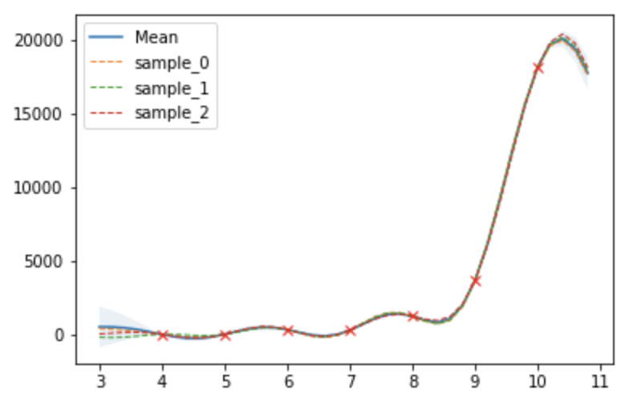
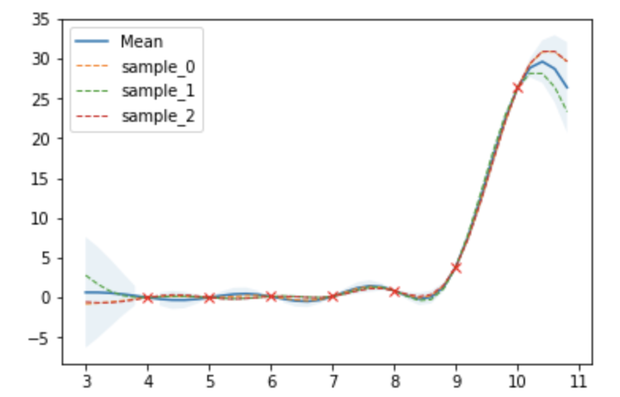

# Assignment3: Genetic Algorithm.
Solve the N-Queens problem with Genetic Algorithm.

## Environments
Tested environments
- Java SE 8u221
- OpenJDK 8
- Windows 10
- Ubuntu 18.04 (WSL)

Suggested environments
- Java >= 8
- bash or PowerShell environment

## Usage
To compile and run
```
mkdir classes
javac -d classes assignment3/Application.java
cd classes
java assignment3.Application 7 /abs/path/to/save/result
```

## Sample result

### Hyperparameter
- tournament==7
- initialNumber==5000
- parentNumber==1000
- crossNumber==4000
- mutationNumber==0

### Output
board size 7
```
>Genetic Algorithm
Location : 4 6 1 5 2 0 3
Time : 0.043
```
board size 8
```
>Genetic Algorithm
Location : 2 4 1 7 0 6 3 5
Time : 0.086
```
board size 12
```
>Genetic Algorithm
Location : 11 4 8 5 2 9 3 0 7 10 6 1
Time : 0.197
```

## Methods

### 1. Genetic Algorithm

유전자(gene, chromosome)라는 상태를 두고, 정책에 따라 유전자를 변이, 평가하며 하나의 군(population)과 세대(generation)를 구성한다. 세대가 지날 수록 군이 문제 해결이라는 목표에 가까워지도록 적절히 변이 정책과 평가 정책을 구성하여 세대 간 정보 전달 과정을 실험하는 알고리즘이다.

변이 과정은 크게 선택, 합성, 돌연변이로 이뤄진다.
1. 선택 : 이전 세대에서 다음 세대로 전달할 유전개체를 선택
2. 합성 : 유전 정보를 합성하여 새로운 개체를 형성
3. 돌연변이 : 유전개체 하나의 정보를 변형

세 번의 변이 과정에서 생성하는 새로운 개체의 수 또한 변이 정책의 일종으로, 군을 구성하는 인구수 또한 조절 가능하다. 선택 과정에서 평가 정책에 따라 가능성 있는 유전개체를 선택, 전달하여 문제 해결을 가능케 한다.

### 2. Policy

### 2.0. State definition

상태는 각 열에 Queen이 위치하고 있는 행의 인덱스로 구성된 N칸 정수 배열을 가정하였다. 이후 변이 과정에서는 배열의 각 값을 [0, N)의 범위 내에서 수정한다.

### 2.1. Intialize

각 배열의 값을 [0, N) 사이의 임의 수로 채워넣었다.

### 2.2. Selection

다음 세대로 전달할 유전개체를 선택하는 과정이다. 선택 과정에는 크게 두가지 방법론이 존재하며, Tournament와 Propertional selection이다.

- Proportional selection

해당 유전개체의 Evalution을 전체에서의 비율로 환산하여 반영하는 방법론이다. 크게는 비율을 확률 분포로 해석, S개의 샘플을 채취하여 다음 세대로 전달한다.  

### 2.2.1. Tournament

Tournament는 이전 세대에서 K개를 샘플링하여 가장 Evaluation 수치가 높은 샘플만을 다음 세대로 전달하는 방식이다. 총 S번 반복하여 N개의 샘플을 다음 세대로 전달하게 된다.

### 2.2.2. Evalution objective

유전개체를 평가하는 방식으로는 [Hill-Climbing](../assignment2)에서 이용하였던 Objective를 재활용한다. 

---
N-Queens의 Constraint는 다음과 같다.
- 각 행에는 하나의 Queen만이 존재한다.
- 각 열에는 하나의 Queen만이 존재한다.
- 각 대각선에는 하나 이하의 Queen이 존재한다.

이를 Objective로 활용하기 위해 각 행과 열, 대각선에 몇 개의 Queen이 존재하는지 나타내는 배열을 정의한다. 이후, 각 배열이 가지는 constraint를 기반으로 objective를 설계한다.
```py
objective = sum(abs(r - 1) for r in row) +
            sum(abs(c - 1) for c in col) +
            sum(max(x - 1, 0) for x in rightdown) +
            sum(max(y - 1, 0) for y in leftdown)
where row, col = N size array
      rightdown, leftdown = (2N - 1) size array
```
여기서 row와 col은 각 행과 열에 위치하는 Queen의 개수, rightdown은 우하향 대각선, leftdown은 좌하향 대각선을 의미한다.

주어진 NxN boolean matrix가 constraint를 만족한다면 objective는 0에 수렴할 것이고, 더 많은 constraint를 어길수록 큰 값을 가지게 된다.

---

### 2.3. Crossover

Crossover은 두 유전개체를 합성하는 과정이다. 알고리즘을 이용하는 사람이 합성 방법을 제시하면, Genetic Solver은 이를 이용하여 유전개체를 합성, 다음 세대로 전달한다. 

이번 [assignment3](.)에서는 다음과 같은 방법을 채택하였다.

1. [0, N) 범위의 임의의 수 P를 생성한다.
2. 이전 세대 유전개체 중 2개를 샘플링 한다 (G1, G2).
3. G1의 유전배열에서 [0, P) 만큼을, G2의 유전배열에서 [P, N) 만큼을 가져와 연결한다.

### 2.4. Mutation

Mutation은 자가 변조 과정이다. 이번 실험에서는 이용하지 않았다. 

### 3. Experiment

- Domain: Board size 4 ~ 10
- #Experiment: 100
- Visualization: Table, Gaussian Process Regression

1. 수렴 시간

한번의 trial이 optima로 수렴하기 위해 걸리는 시간의 평균.

| board size | 4 | 5 | 6 | 7 | 8 | 9 | 10 |
|---|---|---|---|---|---|---|---|
| converge | 5.22e-6 | 3.92e-6 | 1.8146e-4 | 2.1718e-4 | 5.241e-4 | 9.8398e-4 | 1.319126e-3 |


2. Random restart 횟수

solution을 얻기 위한 평균 trial 수.

| board size | 4 | 5 | 6 | 7 | 8 | 9 | 10 |
|---|---|---|---|---|---|---|---|
| #restart | 8.44 | 10.55 | 333.67 | 286.39 | 1246.6 | 3669.96 | 18173.25 |



3. 전체 문제 해결 시간

전체 문제 해결 시간의 평균 및 성공 확률

| board size | 4 | 5 | 6 | 7 | 8 | 9 | 10 |
|---|---|---|---|---|---|---|---|
| elapsed time | 0.005418 | 0.002542 | 0.13647 | 0.13419 | 0.86582 | 3.88714 | 26.3717 |
| success rate | 0.79 | 0.83 | 1 | 1 | 1 | 1 | 1 |



- Correlation Coefficient

| - | converge | restart | total |
|---|---|---|---|
| converge | 1.0 | 0.853203 | 0.822730 |
| restart | - | 1.0 | 0.998423 |
| total | - | - | 1.0 |

앞서 그래프와 선형 상관계수 표에서 볼 수 있듯이, 3가지 요소 모두 높은 상관성을 띈다. 특히 전체 문제 해결 시간과 Random Restart 횟수는 선형 변환 외에 어떤 연산도 취하지 않은 거의 같은 데이터로 볼 수 있다. 

이를 통해서 알고리즘의 특성을 확인할 수 있었는데, board의 크기에 따라 증가하는 neighbor의 수가 선형 관계임에도 불구하고, local search 역시 searching space에 영향을 받아 급격히 탐색 시간이 늘어날 수 있다는 점이었다.

또한, trial의 수를 줄이기 위해 Random Walk를 사용한다면, converge time은 얼마나 늘어날지, 그 증가 속도가 Random Restart보다 효율적일지 확인해 볼 필요가 있어 보인다. 

기존의 탐색 알고리즘보다 backtracking을 하지 않아 메모리 사용량이 적고, neighbor만을 가지고 탐색을 하므로 local optima에 빠질 수 있다는 여러 차이점도 있었지만, 결국은 searching space의 크기에 비례하여 탐색 시간이 기하급수적으로 증가할 수 있다는 단점을 가지고 있었다. 

### 5. Log

수렴 시간

| size | 0 | 1 | 2 | 3 | 4 | 5 | 6 | 7 | 8 | 9 | 10 | 11 | 12 | 13 | 14 | 15 | 16 | 17 | 18 | 19 | 20 | 21 | 22 | 23 | 24 | 25 | 26 | 27 | 28 | 29 | 30 | 31 | 32 | 33 | 34 | 35 | 36 | 37 | 38 | 39 | 40 | 41 | 42 | 43 | 44 | 45 | 46 | 47 | 48 | 49 | 50 | 51 | 52 | 53 | 54 | 55 | 56 | 57 | 58 | 59 | 60 | 61 | 62 | 63 | 64 | 65 | 66 | 67 | 68 | 69 | 70 | 71 | 72 | 73 | 74 | 75 | 76 | 77 | 78 | 79 | 80 | 81 | 82 | 83 | 84 | 85 | 86 | 87 | 88 | 89 | 90 | 91 | 92 | 93 | 94 | 95 | 96 | 97 | 98 | 99 |
|---|---|---|---|---|---|---|---|---|---|---|---|---|---|---|---|---|---|---|---|---|---|---|---|---|---|---|---|---|---|---|---|---|---|---|---|---|---|---|---|---|---|---|---|---|---|---|---|---|---|---|---|---|---|---|---|---|---|---|---|---|---|---|---|---|---|---|---|---|---|---|---|---|---|---|---|---|---|---|---|---|---|---|---|---|---|---|---|---|---|---|---|---|---|---|---|---|---|---|---|---|
| 4 | 2.0E-6 | 2.0E-6 | 8.0E-6 | 2.0E-6 | 4.0E-6 | 2.0E-6 | 4.0E-6 | 8.0E-6 | 4.0E-6 | 0.0 | 4.0E-6 | 2.0E-6 | 2.0E-6 | 0.0 | 0.0 | 4.0E-6 | 2.0E-6 | 6.0E-6 | 0.0 | 0.0 | 2.0E-6 | 2.0E-6 | 2.0E-6 | 4.0E-6 | 4.0E-6 | 0.0 | 2.0E-6 | 0.0 | 0.0 | 2.0E-6 | 0.0 | 0.0 | 6.0E-6 | 1.4E-5 | 1.2E-5 | 0.0 | 0.0 | 8.0E-6 | 0.0 | 4.0E-6 | 2.0E-5 | 2.2E-5 | 0.0 | 0.0 | 0.0 | 0.0 | 0.0 | 2.0E-6 | 0.0 | 8.0E-6 | 2.0E-6 | 8.0E-6 | 2.0E-6 | 0.0 | 2.0E-6 | 2.0E-6 | 0.0 | 4.0E-6 | 2.0E-6 | 2.0E-6 | 2.0E-6 | 2.0E-6 | 4.0E-5 | 3.60E-5 | 2.0E-6 | 2.0E-6 | 2.0E-6 | 0.0 | 2.0E-6 | 0.0 | 4.0E-6 | 4.2E-5 | 0.0 | 2.0E-6 | 2.0E-6 | 2.0E-6 | 8.0E-6 | 8.0E-6 | 0.0 | 0.0 | 0.0 | 2.0E-6 | 6.4E-5 | 2.0E-6 | 2.0E-6 | 0.0 | 2.0E-6 | 2.0E-6 | 2.8E-5 | 3.2E-5 | 2.0E-6 | 0.0 | 8.0E-6 | 8.0E-6 | 0.0 | 2.0E-6 | 6.0E-6 | 4.0E-6 | 8.0E-6 | 0.0 |
| 5 | 0.0 | 4.0E-6 | 0.0 | 4.0E-6 | 6.0E-6 | 4.0E-6 | 2.0E-6 | 2.0E-5 | 1.6E-5 | 1.6E-5 | 4.0E-6 | 0.0 | 6.0E-6 | 2.0E-6 | 8.0E-6 | 1.0E-5 | 4.0E-6 | 0.0 | 6.0E-6 | 6.0E-6 | 6.0E-6 | 2.0E-6 | 0.0 | 0.0 | 4.0E-6 | 0.0 | 4.0E-6 | 2.0E-6 | 8.0E-6 | 2.0E-6 | 0.0 | 2.0E-6 | 2.0E-6 | 4.0E-6 | 2.0E-6 | 6.0E-6 | 2.0E-6 | 0.0 | 1.0E-5 | 4.0E-6 | 2.0E-6 | 8.0E-6 | 4.0E-6 | 8.0E-6 | 2.0E-6 | 2.0E-6 | 0.0 | 4.0E-6 | 0.0 | 1.0E-5 | 0.0 | 2.0E-6 | 2.0E-6 | 2.0E-6 | 8.0E-6 | 2.0E-6 | 4.0E-6 | 2.0E-6 | 8.0E-6 | 2.0E-6 | 8.0E-6 | 6.0E-6 | 0.0 | 2.0E-6 | 4.0E-6 | 2.0E-6 | 4.0E-6 | 4.0E-6 | 2.0E-6 | 4.0E-6 | 0.0 | 2.0E-6 | 4.0E-6 | 2.0E-6 | 0.0 | 0.0 | 0.0 | 2.0E-6 | 2.0E-6 | 4.0E-6 | 2.0E-6 | 2.0E-6 | 2.0E-6 | 8.0E-6 | 0.0 | 2.0E-6 | 2.0E-6 | 8.0E-6 | 1.0E-5 | 2.0E-6 | 0.0 | 1.6E-5 | 4.0E-6 | 1.0E-5 | 2.0E-6 | 0.0 | 4.0E-6 | 2.0E-6 | 1.2E-5 | 2.0E-6 |
| 6 | 6.0E-6 | 5.0E-5 | 1.0E-5 | 1.0E-5 | 6.0E-6 | 1.4E-5 | 5.4E-5 | 8.8E-5 | 1.26E-4 | 1.50E-4 | 7.6E-5 | 2.602E-5 | 8.40E-5 | 1.0E-5 | 2.52E-4 | 1.1E-4 | 1.560E-4 | 4.619E-4 | 5.64E-4 | 4.0E-6 | 3.180E-4 | 2.14E-4 | 1.46E-4 | 4.86E-4 | 1.08E-4 | 7.60E-5 | 1.7E-4 | 8.8E-5 | 1.06E-4 | 1.66E-4 | 4.6E-4 | 8.0E-5 | 1.36E-4 | 6.8E-5 | 1.62E-4 | 5.32E-4 | 1.58E-4 | 2.3E-4 | 5.44E-4 | 1.6E-4 | 5.32E-4 | 4.599E-4 | 5.02E-4 | 1.2E-5 | 5.400E-5 | 8.6E-5 | 2.40E-4 | 8.6E-5 | 3.92E-4 | 4.5E-4 | 8.0E-5 | 3.98E-4 | 5.52E-4 | 1.020E-4 | 6.14E-4 | 1.4E-5 | 5.18E-4 | 2.340E-4 | 3.28E-4 | 5.20E-4 | 5.3E-4 | 4.599E-4 | 5.420E-4 | 3.06E-4 | 2.28E-4 | 1.980E-4 | 3.6E-5 | 2.46E-4 | 6.8E-5 | 3.6E-5 | 3.1E-4 | 1.300E-4 | 5.0E-5 | 2.600E-4 | 5.0E-5 | 2.42E-4 | 6.0E-6 | 2.5E-4 | 7.19E-5 | 4.8E-5 | 1.4E-5 | 1.6E-5 | 4.0E-5 | 1.8E-5 | 4.0E-5 | 1.2E-5 | 2.040E-4 | 8.99E-5 | 4.200E-5 | 2.8E-5 | 8.99E-5 | 1.380E-4 | 1.36E-4 | 1.380E-4 | 2.4E-5 | 3.6E-5 | 8.0E-5 | 1.0E-5 | 2.2E-5 | 5.999E-5 |
| 7 | 8.0E-6 | 1.6E-5 | 8.59E-5 | 1.16E-4 | 7.8E-5 | 1.8E-5 | 8.0E-6 | 8.40E-5 | 2.600E-4 | 1.88E-4 | 5.2E-5 | 2.24E-4 | 3.72E-4 | 1.180E-4 | 4.3E-4 | 5.04E-4 | 4.56E-4 | 5.0E-5 | 1.12E-4 | 4.6E-5 | 4.9E-4 | 3.180E-4 | 2.04E-4 | 5.52E-4 | 4.740E-4 | 5.44E-4 | 2.14E-4 | 3.48E-4 | 1.22E-4 | 1.680E-4 | 5.4E-5 | 4.68E-4 | 1.62E-4 | 5.32E-4 | 6.6E-5 | 1.02E-4 | 2.28E-4 | 1.06E-4 | 4.6E-5 | 8.8E-5 | 3.58E-4 | 3.4E-5 | 4.0E-6 | 2.0E-5 | 2.62E-4 | 1.6E-4 | 1.78E-4 | 1.300E-4 | 3.38E-4 | 4.0E-6 | 1.2E-4 | 5.14E-4 | 4.5E-4 | 1.38E-4 | 2.36E-4 | 8.2E-5 | 2.9E-4 | 1.6E-4 | 6.6E-5 | 1.520E-4 | 1.24E-4 | 3.28E-4 | 4.540E-4 | 4.98E-4 | 2.02E-4 | 1.16E-4 | 1.08E-4 | 1.36E-4 | 5.5E-4 | 4.0E-6 | 1.980E-4 | 3.599E-4 | 8.0E-6 | 5.32E-4 | 5.06E-4 | 9.2E-5 | 8.8E-5 | 1.66E-4 | 1.12E-4 | 2.72E-4 | 4.64E-4 | 2.44E-4 | 4.540E-4 | 1.54E-4 | 4.32E-4 | 3.54E-4 | 1.42E-4 | 3.380E-4 | 3.340E-4 | 1.26E-4 | 4.8E-5 | 3.22E-4 | 1.34E-4 | 3.46E-4 | 1.58E-4 | 1.419E-4 | 4.4E-5 | 1.300E-4 | 1.740E-4 | 1.16E-4 |
| 8 | 5.8E-5 | 2.0E-6 | 8.0E-6 | 1.8E-5 | 3.340E-4 | 5.04E-4 | 7.70E-4 | 7.920E-4 | 6.360E-4 | 7.52E-4 | 8.48E-4 | 5.200E-5 | 2.140E-4 | 8.76E-4 | 9.80E-5 | 7.5E-4 | 3.82E-4 | 7.920E-4 | 9.16E-4 | 8.72E-4 | 8.079E-4 | 7.44E-4 | 6.680E-4 | 7.8E-4 | 3.019E-4 | 9.72E-4 | 9.279E-4 | 8.59E-5 | 8.7E-4 | 2.62E-4 | 8.04E-4 | 2.02E-4 | 8.72E-4 | 8.060E-4 | 7.880E-4 | 7.82E-4 | 7.8E-4 | 8.26E-4 | 8.62E-4 | 3.3E-4 | 2.04E-4 | 3.44E-4 | 8.12E-4 | 8.5E-4 | 7.8E-4 | 8.50E-4 | 5.620E-4 | 6.2E-4 | 8.02E-4 | 8.32E-4 | 6.680E-4 | 8.320E-4 | 1.86E-4 | 5.02E-4 | 8.46E-4 | 8.359E-4 | 7.66E-4 | 8.0E-4 | 7.26E-4 | 7.0E-4 | 7.04E-4 | 7.54E-4 | 7.46E-4 | 4.96E-4 | 7.09E-4 | 6.680E-4 | 3.46E-4 | 1.14E-4 | 1.060E-4 | 6.680E-4 | 6.5E-4 | 6.360E-4 | 5.56E-4 | 6.5E-4 | 6.760E-4 | 5.46E-4 | 5.88E-4 | 8.8E-5 | 5.660E-4 | 5.54E-4 | 1.74E-4 | 4.9E-4 | 4.58E-4 | 4.26E-4 | 2.0E-6 | 1.300E-4 | 4.3E-4 | 4.04E-4 | 3.46E-4 | 3.380E-4 | 2.9E-4 | 1.400E-4 | 3.26E-4 | 1.7E-4 | 1.020E-4 | 1.64E-4 | 1.64E-4 | 1.64E-4 | 4.8E-5 | 1.58E-4 |
| 9 | 0.001176 | 0.0010840 | 0.001142 | 0.001198 | 0.001126 | 0.001256 | 0.001128 | 0.001148 | 0.0011220 | 0.00124 | 0.001189 | 0.00127 | 0.001232 | 4.26E-4 | 0.00132 | 0.001218 | 0.001166 | 0.001234 | 0.001216 | 0.001258 | 0.001186 | 0.001202 | 0.001192 | 9.28E-4 | 0.001234 | 0.001146 | 0.001248 | 5.92E-4 | 0.001224 | 0.001216 | 0.001164 | 0.001176 | 0.001150 | 0.001246 | 0.001246 | 0.001194 | 0.001264 | 0.001248 | 9.44E-4 | 0.001206 | 0.001148 | 6.960E-4 | 0.001206 | 0.001246 | 0.001130 | 0.0011480 | 0.001256 | 0.001156 | 0.001156 | 0.0011819 | 0.001166 | 0.001252 | 0.001174 | 0.001274 | 0.001258 | 0.001234 | 0.001188 | 0.001264 | 0.001050 | 0.001228 | 0.00123 | 1.56E-4 | 0.001238 | 6.24E-4 | 0.001120 | 6.38E-4 | 0.001054 | 0.0010580 | 0.0010940 | 5.54E-4 | 0.001078 | 0.0010220 | 0.001148 | 0.001088 | 0.0011120 | 0.001134 | 9.14E-4 | 9.38E-4 | 0.001066 | 8.72E-4 | 8.3E-4 | 8.28E-4 | 7.96E-4 | 6.46E-4 | 6.32E-4 | 6.580E-4 | 6.96E-4 | 5.04E-4 | 4.88E-4 | 5.819E-4 | 4.540E-4 | 2.84E-4 | 2.94E-4 | 1.92E-4 | 3.7E-4 | 3.26E-4 | 3.2E-4 | 3.3E-4 | 2.32E-4 | 2.3E-4 |
| 10 | 0.001664 | 0.001652 | 0.001640 | 0.001624 | 0.001634 | 0.0016380 | 0.001628 | 0.0016420 | 0.0015760 | 0.00164 | 0.001658 | 0.001626 | 0.001702 | 0.001646 | 0.001628 | 0.001578 | 0.0016780 | 0.001620 | 0.001634 | 0.001674 | 0.0016719 | 0.001702 | 0.001682 | 0.001674 | 0.001692 | 0.0016140 | 0.0016460 | 0.0017079 | 0.0016619 | 0.001682 | 0.001682 | 0.0016519 | 0.0016519 | 0.001734 | 0.0016560 | 0.001674 | 0.001640 | 0.001666 | 0.001732 | 0.001684 | 0.001669 | 0.001650 | 0.0017 | 0.0016560 | 0.001634 | 0.001582 | 0.001674 | 0.001640 | 0.001716 | 0.001564 | 0.001684 | 0.0016619 | 0.0016220 | 0.001626 | 0.001418 | 0.0015 | 0.00159 | 0.001784 | 0.0016719 | 0.001472 | 0.001588 | 0.001508 | 0.001488 | 0.001572 | 0.00134 | 0.001338 | 0.001276 | 0.001368 | 0.0013460 | 0.001408 | 0.001238 | 0.001192 | 0.001196 | 0.0011719 | 0.00116 | 0.0011459 | 0.001134 | 0.001048 | 0.001074 | 0.001118 | 0.001186 | 0.0011439 | 0.0011639 | 9.98E-4 | 8.14E-4 | 6.5E-4 | 0.001034 | 8.84E-4 | 6.56E-4 | 7.54E-4 | 6.720E-4 | 6.78E-4 | 5.78E-4 | 5.72E-4 | 5.12E-4 | 5.52E-4 | 5.16E-4 | 4.78E-4 | 3.64E-4 | 4.06E-4 |

random restart 횟수

| size | 0 | 1 | 2 | 3 | 4 | 5 | 6 | 7 | 8 | 9 | 10 | 11 | 12 | 13 | 14 | 15 | 16 | 17 | 18 | 19 | 20 | 21 | 22 | 23 | 24 | 25 | 26 | 27 | 28 | 29 | 30 | 31 | 32 | 33 | 34 | 35 | 36 | 37 | 38 | 39 | 40 | 41 | 42 | 43 | 44 | 45 | 46 | 47 | 48 | 49 | 50 | 51 | 52 | 53 | 54 | 55 | 56 | 57 | 58 | 59 | 60 | 61 | 62 | 63 | 64 | 65 | 66 | 67 | 68 | 69 | 70 | 71 | 72 | 73 | 74 | 75 | 76 | 77 | 78 | 79 | 80 | 81 | 82 | 83 | 84 | 85 | 86 | 87 | 88 | 89 | 90 | 91 | 92 | 93 | 94 | 95 | 96 | 97 | 98 | 99 |
|---|---|---|---|---|---|---|---|---|---|---|---|---|---|---|---|---|---|---|---|---|---|---|---|---|---|---|---|---|---|---|---|---|---|---|---|---|---|---|---|---|---|---|---|---|---|---|---|---|---|---|---|---|---|---|---|---|---|---|---|---|---|---|---|---|---|---|---|---|---|---|---|---|---|---|---|---|---|---|---|---|---|---|---|---|---|---|---|---|---|---|---|---|---|---|---|---|---|---|---|---|
| 4 | 1 | 3 | 28 | 4 | 14 | 4 | 15 | 18 | 11 | 2 | 13 | 4 | 9 | 3 | 2 | 10 | 1 | 9 | 1 | 3 | 2 | 6 | 5 | 5 | 19 | 0 | 8 | 1 | 0 | 14 | 1 | 1 | 12 | 29 | 32 | 6 | 0 | 30 | 1 | 5 | 12 | 38 | 3 | 3 | 1 | 3 | 2 | 6 | 0 | 10 | 4 | 20 | 10 | 0 | 1 | 4 | 2 | 13 | 6 | 3 | 2 | 8 | 13 | 1 | 6 | 6 | 2 | 4 | 3 | 3 | 17 | 21 | 0 | 5 | 1 | 7 | 23 | 24 | 1 | 7 | 2 | 5 | 11 | 12 | 12 | 2 | 3 | 5 | 3 | 22 | 5 | 0 | 2 | 30 | 2 | 7 | 39 | 7 | 43 | 5 |
| 5 | 0 | 13 | 0 | 12 | 17 | 16 | 7 | 27 | 32 | 25 | 10 | 2 | 7 | 5 | 17 | 31 | 9 | 2 | 8 | 26 | 29 | 2 | 1 | 0 | 7 | 0 | 8 | 10 | 8 | 3 | 1 | 4 | 6 | 12 | 1 | 7 | 4 | 0 | 22 | 14 | 5 | 25 | 11 | 22 | 7 | 3 | 1 | 10 | 1 | 31 | 0 | 4 | 6 | 4 | 24 | 4 | 10 | 4 | 22 | 3 | 27 | 25 | 2 | 1 | 7 | 4 | 13 | 15 | 5 | 11 | 1 | 15 | 9 | 3 | 2 | 4 | 1 | 1 | 2 | 11 | 2 | 4 | 3 | 26 | 9 | 7 | 3 | 22 | 35 | 1 | 0 | 17 | 18 | 41 | 6 | 3 | 16 | 21 | 21 | 39 |
| 6 | 16 | 146 | 42 | 32 | 24 | 21 | 215 | 162 | 280 | 83 | 69 | 33 | 210 | 21 | 391 | 133 | 63 | 421 | 636 | 6 | 339 | 236 | 171 | 824 | 114 | 28 | 194 | 120 | 138 | 178 | 931 | 54 | 105 | 153 | 65 | 1045 | 152 | 280 | 673 | 172 | 846 | 1271 | 658 | 43 | 67 | 86 | 370 | 131 | 282 | 416 | 77 | 266 | 779 | 93 | 714 | 33 | 1128 | 77 | 283 | 606 | 1108 | 443 | 1213 | 432 | 330 | 344 | 59 | 361 | 141 | 53 | 604 | 300 | 65 | 1245 | 114 | 1813 | 20 | 1074 | 175 | 82 | 49 | 61 | 132 | 54 | 138 | 45 | 666 | 241 | 61 | 76 | 263 | 516 | 1256 | 738 | 102 | 246 | 885 | 81 | 137 | 442 |
| 7 | 16 | 34 | 135 | 189 | 113 | 47 | 15 | 85 | 286 | 166 | 68 | 224 | 336 | 118 | 340 | 428 | 386 | 74 | 111 | 14 | 421 | 290 | 199 | 648 | 437 | 653 | 211 | 275 | 115 | 161 | 77 | 468 | 119 | 1062 | 52 | 99 | 174 | 100 | 19 | 61 | 312 | 72 | 6 | 48 | 199 | 109 | 145 | 109 | 297 | 9 | 131 | 1095 | 355 | 121 | 149 | 65 | 313 | 161 | 54 | 130 | 140 | 335 | 421 | 491 | 190 | 87 | 102 | 124 | 618 | 9 | 183 | 328 | 16 | 745 | 600 | 88 | 89 | 132 | 123 | 315 | 535 | 222 | 1171 | 207 | 536 | 922 | 189 | 591 | 668 | 173 | 66 | 1099 | 205 | 781 | 277 | 275 | 96 | 334 | 864 | 1586 |
| 8 | 70 | 4 | 12 | 25 | 218 | 319 | 495 | 758 | 349 | 1248 | 858 | 48 | 126 | 547 | 59 | 1834 | 222 | 2337 | 2414 | 2155 | 592 | 1368 | 411 | 3124 | 78 | 3093 | 2019 | 51 | 1327 | 187 | 1384 | 128 | 640 | 2060 | 1677 | 5005 | 601 | 1132 | 882 | 198 | 125 | 216 | 2460 | 727 | 3980 | 2432 | 359 | 357 | 1121 | 2153 | 410 | 2305 | 95 | 313 | 526 | 663 | 1619 | 1133 | 2218 | 1797 | 717 | 2372 | 1867 | 360 | 2601 | 2480 | 283 | 83 | 68 | 1511 | 1212 | 506 | 432 | 656 | 943 | 7507 | 1992 | 66 | 723 | 1212 | 177 | 779 | 1801 | 4541 | 2 | 151 | 629 | 2450 | 993 | 5685 | 433 | 211 | 4408 | 1373 | 307 | 539 | 3520 | 3087 | 147 | 772 |
| 9 | 705 | 848 | 722 | 716 | 1554 | 1497 | 1764 | 528 | 2360 | 1266 | 2631 | 2680 | 2422 | 194 | 3409 | 5891 | 5487 | 1459 | 5752 | 3857 | 5645 | 2746 | 2311 | 380 | 6825 | 9896 | 3660 | 230 | 3663 | 1082 | 3803 | 1195 | 2102 | 4806 | 1156 | 2676 | 1854 | 1997 | 391 | 6236 | 3884 | 269 | 4123 | 895 | 4362 | 1046 | 1215 | 701 | 12016 | 1328 | 4550 | 4565 | 3447 | 4952 | 14278 | 5969 | 5300 | 3299 | 456 | 2980 | 2193 | 70 | 838 | 258 | 2043 | 305 | 7317 | 3183 | 5659 | 256 | 3752 | 689 | 1293 | 10280 | 10762 | 3640 | 4916 | 24507 | 5131 | 6304 | 2150 | 7172 | 10081 | 1366 | 5109 | 885 | 2992 | 5354 | 11374 | 3928 | 6051 | 416 | 2755 | 339 | 900 | 4425 | 6144 | 647 | 7068 | 6413 |
| 10 | 3628 | 7304 | 2546 | 13983 | 11368 | 18462 | 18539 | 19254 | 1594 | 1903 | 10925 | 2367 | 28217 | 13466 | 28898 | 29691 | 10265 | 31378 | 17384 | 4049 | 5067 | 16106 | 6562 | 6712 | 6406 | 921 | 11925 | 6042 | 14619 | 2446 | 16106 | 19481 | 20833 | 693 | 7954 | 22340 | 8220 | 51975 | 53634 | 5203 | 1017 | 13906 | 25841 | 57746 | 1680 | 45011 | 15545 | 43120 | 5866 | 8429 | 26744 | 13572 | 4754 | 3813 | 14480 | 49441 | 31022 | 49808 | 37033 | 96061 | 10954 | 19946 | 23135 | 2460 | 19050 | 4695 | 3376 | 8429 | 3701 | 5572 | 19592 | 2448 | 37519 | 10496 | 57643 | 30092 | 7999 | 45440 | 17093 | 27594 | 13752 | 12865 | 15202 | 2802 | 9521 | 369 | 3378 | 1187 | 21921 | 63583 | 52366 | 8148 | 4226 | 16572 | 8316 | 58614 | 21719 | 8489 | 30574 | 3132 |

전체 문제 해결 시간 데이터

| size | 0 | 1 | 2 | 3 | 4 | 5 | 6 | 7 | 8 | 9 | 10 | 11 | 12 | 13 | 14 | 15 | 16 | 17 | 18 | 19 | 20 | 21 | 22 | 23 | 24 | 25 | 26 | 27 | 28 | 29 | 30 | 31 | 32 | 33 | 34 | 35 | 36 | 37 | 38 | 39 | 40 | 41 | 42 | 43 | 44 | 45 | 46 | 47 | 48 | 49 | 50 | 51 | 52 | 53 | 54 | 55 | 56 | 57 | 58 | 59 | 60 | 61 | 62 | 63 | 64 | 65 | 66 | 67 | 68 | 69 | 70 | 71 | 72 | 73 | 74 | 75 | 76 | 77 | 78 | 79 | 80 | 81 | 82 | 83 | 84 | 85 | 86 | 87 | 88 | 89 | 90 | 91 | 92 | 93 | 94 | 95 | 96 | 97 | 98 | 99 |
|---|---|---|---|---|---|---|---|---|---|---|---|---|---|---|---|---|---|---|---|---|---|---|---|---|---|---|---|---|---|---|---|---|---|---|---|---|---|---|---|---|---|---|---|---|---|---|---|---|---|---|---|---|---|---|---|---|---|---|---|---|---|---|---|---|---|---|---|---|---|---|---|---|---|---|---|---|---|---|---|---|---|---|---|---|---|---|---|---|---|---|---|---|---|---|---|---|---|---|---|---|
| 4 | 0.018 | 0.001 | 0.003 | 0.008 | 0.01 | 0.001 | 0.018 | 0.002 | 0.001 | 0.003 | 0.003 | 0.001 | 0.032 | 0.001 | 0.001 | 0.001 | 0.001 | 0.006 | 0.001 | 0.003 | 0.001 | 0.003 | 0.002 | 0.002 | 0.002 | 0.015 | 0.001 | 0.001 | 0.001 | 0.001 | 0.001 | 0.003 | 0.001 | 0.019 | 0.015 | 0.003 | 0.001 | 0.002 | 0.001 | 0.001 | 0.014 | 0.02 | 0.001 | 0.023 | 0.004 | 0.001 | 0.005 | 0.003 | 0.005 | 0.017 | 0.021 | 0.003 | 0.004 | 0.001 | 0.001 | 0.001 | 0.001 | 0.019 | 0.018 | 0.001 | 0.001 | 0.001 | 0.001 | 0.001 | 0.001 | 0.01 | 0.004 | 0.001 | 0.016 | 0.001 | 0.013 | 0.002 | 0.001 | 0.001 | 0.001 | 0.001 | 0.015 | 0.001 | 0.002 |
| 5 | 0.002 | 0.008 | 0.005 | 0.004 | 0.001 | 0.003 | 0.005 | 0.001 | 0.001 | 0.01 | 0.005 | 0.002 | 0.001 | 0.001 | 0.003 | 0.001 | 0.002 | 0.008 | 0.004 | 0.001 | 0.005 | 0.001 | 0.002 | 0.005 | 0.003 | 0.002 | 0.001 | 0.003 | 0.001 | 0.003 | 0.002 | 0.001 | 0.001 | 0.002 | 0.004 | 0.002 | 0.002 | 0.001 | 0.004 | 0.001 | 0.002 | 0.004 | 0.001 | 0.001 | 0.001 | 0.001 | 0.004 | 0.002 | 0.002 | 0.006 | 0.003 | 0.002 | 0.001 | 0.001 | 0.001 | 0.001 | 0.004 | 0.002 | 0.002 | 0.001 | 0.001 | 0.002 | 0.001 | 0.004 | 0.002 | 0.005 | 0.001 | 0.004 | 0.001 | 0.001 | 0.002 | 0.001 | 0.001 | 0.001 | 0.002 | 0.001 | 0.008 | 0.005 | 0.001 | 0.002 | 0.001 | 0.006 | 0.002 |
| 6 | 0.003 | 0.319 | 0.002 | 0.326 | 0.244 | 0.492 | 0.043 | 0.045 | 0.014 | 0.075 | 0.117 | 0.039 | 0.173 | 0.054 | 0.05 | 0.042 | 0.079 | 0.398 | 0.234 | 0.123 | 0.026 | 0.007 | 0.24 | 0.073 | 0.039 | 0.054 | 0.086 | 0.08 | 0.362 | 0.007 | 0.364 | 0.083 | 0.115 | 0.83 | 0.003 | 0.024 | 0.008 | 0.021 | 0.021 | 0.105 | 0.005 | 0.033 | 0.577 | 0.027 | 0.043 | 0.043 | 0.397 | 0.189 | 0.026 | 0.026 | 0.166 | 0.141 | 0.086 | 0.068 | 0.556 | 0.372 | 0.007 | 0.02 | 0.009 | 0.006 | 0.427 | 0.035 | 0.671 | 0.115 | 0.019 | 0.018 | 0.145 | 0.045 | 0.096 | 0.005 | 0.031 | 0.076 | 0.014 | 0.057 | 0.425 | 0.006 | 0.21 | 0.04 | 0.051 | 0.12 | 0.004 | 0.49 | 0.655 | 0.1 | 0.065 | 0.211 | 0.012 | 0.018 | 0.011 | 0.031 | 0.046 | 0.044 | 0.005 | 0.079 | 0.348 | 0.121 | 0.203 | 0.192 | 0.155 | 0.034 |
| 7 | 0.13 | 0.347 | 0.114 | 0.023 | 0.164 | 0.033 | 0.063 | 0.181 | 0.004 | 0.084 | 0.058 | 0.216 | 0.056 | 0.175 | 0.027 | 0.131 | 0.562 | 0.077 | 0.072 | 0.289 | 0.004 | 0.565 | 0.044 | 0.017 | 0.002 | 0.01 | 0.119 | 0.076 | 0.101 | 0.241 | 0.045 | 0.094 | 0.574 | 0.167 | 0.058 | 0.396 | 0.063 | 0.024 | 0.079 | 0.065 | 0.039 | 0.39 | 0.18 | 0.06 | 0.346 | 0.002 | 0.136 | 0.293 | 0.071 | 0.023 | 0.008 | 0.263 | 0.026 | 0.023 | 0.103 | 0.084 | 0.051 | 0.08 | 0.069 | 0.08 | 0.189 | 0.238 | 0.081 | 0.054 | 0.065 | 0.393 | 0.045 | 0.057 | 0.231 | 0.067 | 0.009 | 0.23 | 0.235 | 0.033 | 0.09 | 0.227 | 0.054 | 0.099 | 0.046 | 0.225 | 0.042 | 0.026 | 0.248 | 0.109 | 0.226 | 0.041 | 0.305 | 0.122 | 0.202 | 0.189 | 0.004 | 0.112 | 0.06 | 0.191 | 0.061 | 0.169 | 0.002 | 0.251 | 0.068 | 0.446 |
| 8 | 0.029 | 0.001 | 4.155 | 0.914 | 1.939 | 0.174 | 0.331 | 0.757 | 0.087 | 0.41 | 0.387 | 0.716 | 0.026 | 1.731 | 0.585 | 0.929 | 0.166 | 0.102 | 0.293 | 0.555 | 1.97 | 1.793 | 0.493 | 0.59 | 1.247 | 0.524 | 2.952 | 0.327 | 0.052 | 0.088 | 1.482 | 0.192 | 0.482 | 1.232 | 1.782 | 0.251 | 0.882 | 1.062 | 0.439 | 0.441 | 0.253 | 1.734 | 0.336 | 5.728 | 0.889 | 0.261 | 0.842 | 0.516 | 0.024 | 0.125 | 2.503 | 0.151 | 2.035 | 1.706 | 2.59 | 0.001 | 0.066 | 0.385 | 0.146 | 0.07 | 0.608 | 0.319 | 0.456 | 0.049 | 3.381 | 1.851 | 0.249 | 1.204 | 0.044 | 1.146 | 0.004 | 0.167 | 2.613 | 0.043 | 2.029 | 0.338 | 1.351 | 0.818 | 0.282 | 2.09 | 1.897 | 1.234 | 0.132 | 0.101 | 1.869 | 0.093 | 1.803 | 0.057 | 0.053 | 0.608 | 0.009 | 0.974 | 0.108 | 1.117 | 1.524 | 0.741 | 0.172 | 0.312 | 0.434 | 1.373 |
| 9 | 0.89 | 6.855 | 17.259 | 2.723 | 0.078 | 10.693 | 3.196 | 1.3 | 0.096 | 0.368 | 11.793 | 0.297 | 1.421 | 1.404 | 2.284 | 0.476 | 0.348 | 1.266 | 1.595 | 12.532 | 1.756 | 6.831 | 4.633 | 4.649 | 1.099 | 7.324 | 0.527 | 2.408 | 0.32 | 3.994 | 0.767 | 0.843 | 1.486 | 8.358 | 2.541 | 5.238 | 4.11 | 3.71 | 0.982 | 0.312 | 2.722 | 2.985 | 3.279 | 5.734 | 2.442 | 5.53 | 4.022 | 4.241 | 0.719 | 6.658 | 1.739 | 0.609 | 3.228 | 0.215 | 1.749 | 28.521 | 2.363 | 0.891 | 3.367 | 0.144 | 7.019 | 2.747 | 0.466 | 7.589 | 1.503 | 0.828 | 6.524 | 3.671 | 1.433 | 5.651 | 1.994 | 4.184 | 14.525 | 11.93 | 9.209 | 1.801 | 1.57 | 0.214 | 1.907 | 1.496 | 0.83 | 6.544 | 4.433 | 1.318 | 4.973 | 5.997 | 6.556 | 0.278 | 7.479 | 1.931 | 3.007 | 4.746 | 4.478 | 3.24 | 5.475 | 8.75 | 5.08 | 4.663 | 0.568 | 2.187 |
| 10 | 11.883 | 4.239 | 18.2 | 16.892 | 19.757 | 37.231 | 82.566 | 17.072 | 6.765 | 5.103 | 51.716 | 10.801 | 32.649 | 44.226 | 59.594 | 28.235 | 13.033 | 9.497 | 17.352 | 3.027 | 23.034 | 28.738 | 11.088 | 34.65 | 1.207 | 13.716 | 24.436 | 50.28 | 62.609 | 14.89 | 5.707 | 18.773 | 22.301 | 8.382 | 10.68 | 1.506 | 9.974 | 75.708 | 22.31 | 6.092 | 30.542 | 2.619 | 26.73 | 26.706 | 13.58 | 82.828 | 29.43 | 4.468 | 68.483 | 5.489 | 49.279 | 97.573 | 2.755 | 9.635 | 23.722 | 53.754 | 51.544 | 2.746 | 4.029 | 11.245 | 30.365 | 3.146 | 3.963 | 90.168 | 1.696 | 25.81 | 13.925 | 7.814 | 31.096 | 3.78 | 31.769 | 86.594 | 9.546 | 44.288 | 36.382 | 38.853 | 15.831 | 39.651 | 4.369 | 1.254 | 46.557 | 158.769 | 12.15 | 7.788 | 3.135 | 33.238 | 9.915 | 0.326 | 3.303 | 1.082 | 47.797 | 6.71 | 23.88 | 4.063 | 72.914 | 85.137 | 20.211 | 20.24 | 11.15 | 15.432 |
