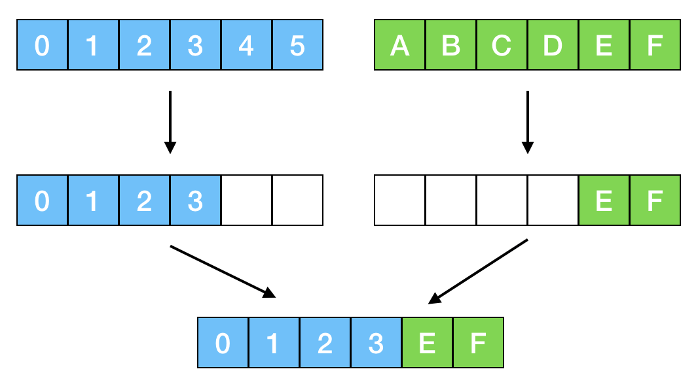

# Assignment3: Genetic Algorithm.
Solve the N-Queens problem with Genetic Algorithm.

## Environments
Tested environments
- Java SE 8u221
- OpenJDK 8
- Windows 10
- Ubuntu 18.04 (WSL)

Suggested environments
- Java >= 8
- bash or PowerShell environment

## Usage
To compile and run
```
mkdir classes
javac -d classes assignment3/Application.java
cd classes
java assignment3.Application 7 /abs/path/to/save/result
```

## Sample result

### Hyperparameter
- tournament==7
- initialNumber==5000
- parentNumber==1000
- crossNumber==4000
- mutationNumber==0
- maxIter==50

### Output
board size 7
```
>Genetic Algorithm
Location : 4 2 0 5 3 1 6
Time : 0.029
```
board size 8
```
>Genetic Algorithm
Location : 2 7 3 6 0 5 1 4
Time : 0.088
```
board size 12
```
>Genetic Algorithm
Location : 11 4 8 5 2 9 3 0 7 10 6 1
Time : 0.197
```

## Methods

### 1. Genetic Algorithm

유전자(gene, chromosome)라는 상태를 두고, 정책에 따라 유전자를 변이, 평가하며 하나의 군(population)과 세대(generation)를 구성한다. 세대가 지날수록 군이 문제 해결이라는 목표에 가까워지도록 적절히 변이 정책과 평가 정책을 구성하여 세대 간 정보 전달 과정을 실험하는 알고리즘이다.

변이 과정은 크게 선택, 합성, 돌연변이로 이뤄진다.
1. 선택 : 이전 세대에서 다음 세대로 전달할 유전 개체를 선택
2. 합성 : 유전 정보를 합성하여 새로운 개체를 형성
3. 돌연변이 : 유전 개체 하나의 정보를 변형

변이 과정에서 생성하는 새로운 개체의 수 또한 변이 정책의 일종으로, 군을 구성하는 인구수 또한 조절할 수 있다.

선택 과정에서 평가 정책에 따라 가능성 있는 유전 개체를 선택, 전달하여 문제 해결을 가능케 한다.

### 2. Policy

#### 2.0. State definition

Queen이 위치하고 있는 행으로 구성된 N 칸 정수 배열을 가정하였다. 이후 변이 과정에서는 배열의 각 값을 [0, N)의 범위 내에서 수정한다.

#### 2.1. Initialize

각 배열의 값을 [0, N) 사이의 임의 수로 채워 넣었다 (Uniform distribution).

#### 2.2. Selection

다음 세대로 전달할 유전 개체를 선택하는 과정이다. 선택 과정에는 크게 두 가지 방법론이 존재하며, Tournament와 Proportional selection이 있다. Proportional selection에 대한 설명은 다음으로 미룬다.

#### 2.2.1. Tournament

Tournament는 이전 세대에서 K개를 샘플링하여 가장 Evaluation 수치가 높은 샘플만을 다음 세대로 전달하는 방식이다. 총 S 번 반복하여 S개의 샘플을 다음 세대로 전달하게 된다.

#### 2.2.2. Evalution objective

유전 개체를 평가하는 방식으로는 [Hill-Climbing](../assignment2#2-objective)에서 이용하였던 Objective를 재활용한다. 

---
N-Queens의 Constraint는 다음과 같다.
- 각 행에는 하나의 Queen만이 존재한다.
- 각 열에는 하나의 Queen만이 존재한다.
- 각 대각선에는 하나 이하의 Queen이 존재한다.

이를 Objective로 활용하기 위해 각 행과 열, 대각선에 몇 개의 Queen이 존재하는지 나타내는 배열을 정의한다. 이후, 각 배열이 가지는 constraint를 기반으로 objective를 설계한다.
```py
objective = sum(abs(r - 1) for r in row) +
            sum(abs(c - 1) for c in col) +
            sum(max(x - 1, 0) for x in rightdown) +
            sum(max(y - 1, 0) for y in leftdown)
where row, col = N size array
      rightdown, leftdown = (2N - 1) size array
```
여기서 row와 col은 각 행과 열에 위치하는 Queen의 개수, right down은 우하향 대각선, left down은 좌하향 대각선을 의미한다.

주어진 NxN boolean matrix가 constraint를 만족한다면 objective는 0에 수렴할 것이고, 더 많은 constraint를 어길수록 큰 값을 가지게 된다.

---

#### 2.3. Crossover

Crossover는 두 유전 개체를 합성하는 과정이다. 알고리즘을 이용하는 사람이 합성 방법을 제시하면, Genetic Solver은 이를 이용하여 유전 개체를 합성, 다음 세대로 전달한다. 

이번 [assignment3](.)에서는 다음과 같은 방법을 채택하였다.

1. [0, N) 범위의 임의의 수 P를 생성한다.
2. 이전 세대 유전 개체 중 2개를 샘플링 한다 (G1, G2).
3. G1의 유전배열에서 [0, P)만큼을, G2의 유전배열에서 [P, N)만큼을 가져와 연결한다.



#### 2.4. Mutation

Mutation은 자가 변조 과정이다. 이번 실험에서는 이용하지 않았다. 

## Experiment

- Setting
    - Domain: Board size 4 ~ 10
    - #Experiment: 100, Mean
    - Visualization: Table, Gaussian Process Regression

- Hyperparameter
    - tournament==7
    - initialNumber==5000
    - parentNumber==1000
    - crossNumber==4000
    - mutationNumber==0
    - maxIter==50

1. 문제 해결 시간

한번의 Genetic Simulation이 수렴하기 위해 걸리는 시간의 평균 (sec, [elapsed_time.txt](./log/elapsed_time.txt))

| board size | 4 | 5 | 6 | 7 | 8 | 9 | 10 |
|---|---|---|---|---|---|---|---|
| converge | 0.04425 | 0.01990 | 0.04699 | 0.04760 | 0.10779 | 0.19170 | 0.37460 |
| success | 100 | 100 | 99 | 100 | 100 | 95 | 41 |

한번의 Genetic Simulation이 수렴하기 위해 걸리는 Step의 수의 100회 평균 (횟수, [elapsed_time.txt](./log/elapsed_time.txt))

| board size | 4 | 5 | 6 | 7 | 8 | 9 | 10 |
|---|---|---|---|---|---|---|---|
| step | 0 | 0 | 0.23 | 0.38 | 1.82 | 3.36 | 5.34 |

2. Hyperparameter Search

Number of tournament

| #tournament | 4 | 5 | 6 | 7 | 8 | 9 | 10 | Total |
|---|---|---|---|---|---|---|---|---|
| T5 | 0 | 0 | 0 | 0 | 0 | 0 | 0 | 0 |
| T10 | 0 | 0 | 0 | 0 | 0 | 0 | 0 | 0 |
| T30 | 0 | 0 | 0 | 0 | 0 | 0 | 0 | 0 |
| T50 | 0 | 0 | 0 | 0 | 0 | 0 | 0 | 0 |

Number of initial state (Maintain the ratio of Selection, Crossover, Mutation)

| #initial | 4 | 5 | 6 | 7 | 8 | 9 | 10 | Total |
|---|---|---|---|---|---|---|---|---|
| I100 | 0 | 0 | 0 | 0 | 0 | 0 | 0 | 0 |
| I500 | 0 | 0 | 0 | 0 | 0 | 0 | 0 | 0 |
| I-1K | 0 | 0 | 0 | 0 | 0 | 0 | 0 | 0 |
| I-5K | 0 | 0 | 0 | 0 | 0 | 0 | 0 | 0 |
| I-10K | 0 | 0 | 0 | 0 | 0 | 0 | 0 | 0 |

Number of selections (Crossover = Initial - Selection)

| #selection | 4 | 5 | 6 | 7 | 8 | 9 | 10 | Total |
|---|---|---|---|---|---|---|---|---|
| S500 | 0 | 0 | 0 | 0 | 0 | 0 | 0 | 0 |
| S-1K | 0 | 0 | 0 | 0 | 0 | 0 | 0 | 0 |
| S-3K | 0 | 0 | 0 | 0 | 0 | 0 | 0 | 0 |

Number of crossover (Selection = Initial - Crossover)

| #crossover | 4 | 5 | 6 | 7 | 8 | 9 | 10 | Total |
|---|---|---|---|---|---|---|---|---|
| C500 | 0 | 0 | 0 | 0 | 0 | 0 | 0 | 0 |
| C-1K | 0 | 0 | 0 | 0 | 0 | 0 | 0 | 0 |
| C-3K | 0 | 0 | 0 | 0 | 0 | 0 | 0 | 0 |

- Correlation Coefficient

| - | tournament | initial | selection | crossover |
|---|---|---|---|---|
| tournament | 0 | 0 | 0 | 0 |
| initial | - | 0 | 0 | 0 |
| selection | - | - | 0 | 0 |
| crossover | - | - | - | 0 |

<해설>

3. Method variant

Subsequence crossover vs Element-wise crossover

| board size | 4 | 5 | 6 | 7 | 8 | 9 | 10 | Total |
|---|---|---|---|---|---|---|---|---|
| E5 | 0 | 0 | 0 | 0 | 0 | 0 | 0 | 0 |
| E10 | 0 | 0 | 0 | 0 | 0 | 0 | 0 | 0 |
| E30 | 0 | 0 | 0 | 0 | 0 | 0 | 0 | 0 |
| E50 | 0 | 0 | 0 | 0 | 0 | 0 | 0 | 0 |

## Log


