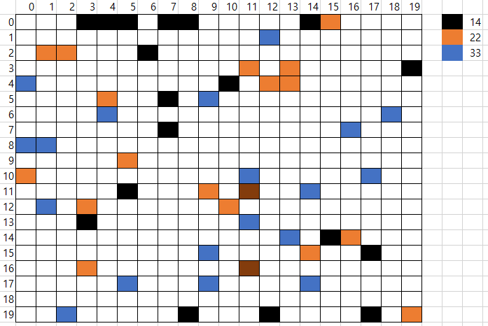

# Assignment4: SAT Solver.
Solve the N-Queens problem with SAT solver.

## Environments
Tested environments
- python 3.7.3
- z3-solver 4.5.1.0.post2
- Windows 10

Suggested environments
- Python3
- z3-solver 4.5.1.0.post2

## Usage

To run solver

```
PS assignment4> python .\nQueensOpt.py
N: 20
[7, 9, 11, 2, 14, 3, 18, 8, 13, 5, 10, 1, 16, 6, 20, 17, 19, 12, 15, 4]
elapsed time: 12.4160315990448 sec
```

## Sample result

Mahcine Environments

- Intel(R) Core(TM) i7-8700 CPU @ 3.20GHz
- 32GB Memory
- Samsung SSD 850 PRO 256GB

naive: 105sec

```
N: 20
[17, 4, 11, 8, 16, 19, 1, 5, 15, 10, 12, 3, 18, 13, 2, 6, 20, 14, 7, 9]
elapsed time: 105.02632117271423 sec
```

optimized: 12sec (10x speed)
```
N: 20
[7, 9, 11, 2, 14, 3, 18, 8, 13, 5, 10, 1, 16, 6, 20, 17, 19, 12, 15, 4]
elapsed time: 12.4160315990448 sec
```

## Preface: SAT Solver

Satisfiability solver, 이하 SAT solver는 주어진 logical statements를 모두 만족시키는 Model을 구하는 알고리즘, 혹은 그 구현체이다. Model을 구성할 각 심볼과 해당 심볼로 구성된 logical statements를 정의하면, SAT Solver은 해당 심볼에 값을 대입해 가며 충족 가능성을 연산한다.

N-Queens에서는 NxN Boolean Matrix를 통해 Queen의 위치를 나타내고, constraint와 여러 heuristic을 logical statements로 표현한다. SAT solver가 모든 문장을 만족시키는 해를 찾으면, 그 해가 N-Queens problem의 정해가 된다.

## Naive Method

미리 주어진 풀이이다. Symbol과 Constraint에 관련된 정의만 존재하고, 추가 heuristic은 존재하지 않는다.

```
N: 20
[17, 4, 11, 8, 16, 19, 1, 5, 15, 10, 12, 3, 18, 13, 2, 6, 20, 14, 7, 9]
elapsed time: 105.02632117271423 sec
```

### 1. Symbol representation

NxN Integer Matrix를 상정한다. 이는 z3에서 지원하는 Sum operatoion을 이용하기 위함으로 보이며, 값이 0과 1로 한정되어야 하는 부분은 추후 Constraint를 통해 표현한다.

```py
x = [[z3.Int(f'x_{row}_{col}')
     for col in range(num_queens)]
     for row in range(num_queens)]
```

### 2. Constraint representation

1. domain constraint

NxN matrix에서 각 cell은 퀸의 존재 여부를 나타내므로 값을 0 혹은 1로 한정한다.

```py
domain = [z3.Or(x[row][col] == 0, x[row][col] == 1)
          for col in range(num_queens)
          for row in range(num_queens)]
```

2. row, column constraint

각 행과 열에는 단 하나의 퀸만이 존재한다. naive에서는 이를 각 행과 열에 주어진 수의 합이 1임을 상정했다.

```py
row_constraint = [z3.Sum(x[row]) == 1 for row in range(num_queens)]
col_constraint = [z3.Sum([x[row][col] for row in range(num_queens)]) == 1
                  for col in range(num_queens)]
```

3. diagonal constraint

각 대각선에 존재하는 퀸의 수는 하나 이하이다. naive에서는 모든 매트릭스를 순회하면 주어진 두 퀸에 대해서 좌표값의 차, 혹은 합을 통해 동일 대각선상에 존재하는지 확인했다.

```py
diagonal_constraint = \
    [z3.Implies(z3.And(x[i][j] == 1, x[k][h] == 1, i != k, j != h),
                abs(k - i) != abs(j - h))
    for i in range(num_queens) for j in range(num_queens)
    for k in range(num_queens) for h in range(num_queens)]
```

## Optimizing

위 보다 빠른 환경을 조성하기 위해 Constraint와 Heuristic을 수정해 보았다. 

### 1. Symbol representation

Symbol 표현은 위와 동일히 NxN Integer matrix를 상정한다.

### 2. Constraint representation

N-Queens의 Constraint와 Objective에 관해서는 이전 Genetic Algorithm, Hill Climbing Method 당시에 이용했던 것을 차용하였다.

먼저 매트릭스를 순회하며 각 변수를 해당 변수가 속한 row-wise cluster, column-wise cluster, diagonal-wise cluster에 할당한다. 이후 각 클러스터의 합이 1인지, diagonal의 경우 1 이하인지 확인하는 constraint를 구상하였다.

```py
const = [Sum(r) == 1 for r in row] +
        [Sum(c) == 1 for c in col] +
        [Sum(x) <= 1 for x in rightdown] +
        [Sum(y) <= 1 for y in leftdown]
where row, col = N size array
      rightdown, leftdown = (2N - 1) size array
```

이를 default constraint로 하여 추후 실험을 진행하였다. 일전보다 constraint가 간략화 되어 실행 속도가 10배 가량 빨라졌다.

```
N: 20
[7, 9, 11, 2, 14, 3, 18, 8, 13, 5, 10, 1, 16, 6, 20, 17, 19, 12, 15, 4]
elapsed time: 12.257997751235962 sec
```

### 3. Heuristic representation

몇가지 휴리스틱을 적용했을 때의 속도를 확인해 보았다.

1. 8-Neighbor heuristic: in-and

한점이 주어졌을 때, 해당 지점에 퀸이 있는 경우 주변 8칸에 퀸이 존재하지 않음을 imply 와 and로 표현하였다. 이 때 셀 하나당 추가 constraint가 하나 발생한다.

```py
z3.Implies(
    x[i][j] == 1,
    z3.And([x[nx][ny] == 0 for nx, ny
           in neighbor_fn(i, j, num_queens)]))
```

실험 결과 근 100초로, 오히려 default constraint에 비해 느린 속도를 기록하였다.

```
N: 20
[15, 5, 10, 16, 6, 4, 1, 7, 17, 19, 11, 2, 18, 20, 8, 3, 13, 9, 14, 12]
elapsed time: 96.56402397155762 sec
```

2. 8-Neighbor heuristic: out-and

1번과 같지만, And로 묶지 않고 각각의 imply를 모두 추가한다.

```py
for nx, ny in neighbor_fn(i, j, num_queens):
    const.append(
        z3.Implies(x[i][j] ==1, x[nx][ny] == 0))
```

마찬가지로 느린 속도를 기록하였다.

```
N: 20
[12, 1, 15, 11, 20, 3, 17, 8, 2, 13, 19, 10, 7, 5, 16, 18, 4, 14, 9, 6]
elapsed time: 98.3421082496643 sec
```

3. 4-Neighbor heuristic: vertical-horizontal, in-and

이번엔 8개의 neighbor 대신 상하좌우 4개의 neighbor만을 in-and 방식으로 구성하였다.

결과, 8-Neighbor에 비해 2배 정도 빨라진 것을 확인할 수 있었다. 하지만 여전히 default constraint에 비해 5배 정도 느리다.

```
N: 20
[4, 12, 15, 17, 7, 5, 2, 9, 20, 16, 11, 3, 18, 6, 19, 14, 10, 1, 13, 8]
elapsed time: 59.96304392814636 sec
```

4. 4-Neighbor heuristic: vertical-horizontal, out-and

상하좌우 4개 neighbor에 out-and 방식으로 구성하였다. 결과, 다시 기존만큼 느려졌으며, 이는 constraint 수의 증가 때문으로 예상된다.

```
N: 20
[7, 18, 6, 13, 20, 16, 11, 4, 1, 5, 19, 12, 15, 2, 8, 10, 14, 3, 17, 9]
elapsed time: 105.1293785572052 sec
```

5. 4-Neighbor heuristic: diagonal, in-and

이번엔 대각선상에 존재하는 4개의 Neighbor를 in-and 방식으로 구성하였다. 8개 Neighbor에 비해서 조금 빨라진 듯 하지만, 여전히 많이 느리다.

```
N: 20
[15, 10, 6, 16, 20, 1, 7, 5, 14, 11, 17, 3, 9, 4, 2, 8, 19, 12, 18, 13]
elapsed time: 75.21825385093689 sec
```

이는 대각선의 갯수가 행이나 열의 수보다 많아 무조건적으로 퀸이 존재하지 않는 줄이 생기고, `x[nx][ny] == 0` 임을 판단하는 neighbor heuristic에서 큰 의미를 갖지 못했기 때문으로 예상된다.

6. 4-Skipped neighbor

기존의 Neighbor heuristic이 주변 한칸의 셀만 보았기에, 이번에는 window 크기를 두어 중심으로 부터 s(=2)칸 떨어진 상하좌우 방향의 4개 cell만을 확인하게 구현하였다.

결과 69초로, 주변 한칸의 셀을 보는 것이 더 효율적임을 알 수 있었다. 이는 추가 constraint 수에 따른 오버헤드와 constraint로 인해 early stopping이 가능해지는 순간의 교차점이 있었음을 알 수 있다.

```
N: 20
[13, 18, 2, 17, 8, 4, 15, 9, 6, 20, 16, 19, 3, 5, 10, 12, 1, 11, 7, 14]
elapsed time: 69.35773015022278 sec
```

7. Random-neighbor heuristic

기존의 방법이 deterministic하게 neighbor을 결정하였다면, 이번에는 N개의 cell을 샘플링하여 해당 셀에 대해서만 neighbor heuristic을 적용하는 방식이다.

4-Neighbor vertical-horizontal in-and 방식으로 구현하였다.

RandomSeed 1024

```
N: 20
[13, 8, 2, 15, 1, 6, 20, 18, 7, 14, 19, 9, 16, 4, 10, 17, 11, 5, 3, 12]
elapsed time: 22.25399947166443 sec
```

RandomSeed 512

```
N: 20
[3, 6, 16, 14, 17, 11, 5, 8, 4, 13, 19, 2, 20, 1, 9, 15, 18, 7, 10, 12]
elapsed time: 14.47402834892273 sec
```

RandomSeed 256

```
N: 20
[14, 10, 8, 15, 20, 3, 13, 6, 9, 19, 5, 1, 4, 16, 18, 11, 7, 17, 2, 12]
elapsed time: 33.65429401397705 sec
```

실험 결과 seed값과 randomness의 차이가 커 사용이 어려울 듯 하다. 각 시드값에서 나오는 좌표의 경향성을 알아보기 위해 간단히 colormap을 찍어보았다.



하지만 데이터가 적어 통계화가 어렵고, 가시적인 부분에서는 가장 빨랐던 검정색 좌표들이 보다 모서리에 위치했다는 것만을 확인할 수 있었다.

가장 빨랐던 검정색 좌표 또한 기존의 default cosntraint에 비해 느렸기 때문에 모든 heuristic에 실패하였다.

## Conclusion

z3를 이용할 때에는 constraint의 수가 절대적이었다. 휴리스틱의 추가보다는 기존의 constraint를 얼마나 더 적은 문장으로 표현하냐가 관건이었고, default constraint만으로 이뤄진 최대 10배 빠른 solver를 구현할 수 있었다.

## Future Work

Heuristic 중 가장 가능성 있던 random neighbor heuristic을 보완하기 위해 더 많은 시드값으로 실험, 통계화하여 deterministic하게 고정된 지점의 neighbor만을 constraint로 추가해 보는게 좋을 듯 하다.
